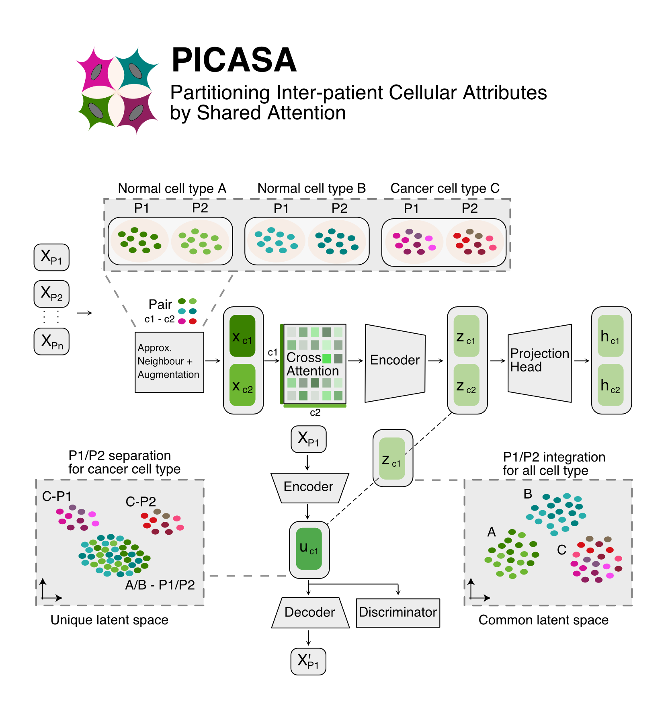

    

### This is a project repository for -
* Subedi, S. & Park, Y. P. (2025)
Attention based decomposition of single-cell data reveals common
cell state and patient-specific effects in cancer. (Inprep)

## Tutorial

For the step-by-step tutorial, please refer to:

<a href="https://github.com/causalpathlab/picasa/tree/main/picasa_reproducibility/analysis/tutorial/1_training_picasa_model.ipynb">
 Tutorial 1. Training PICASA model using simulated datasets.</a>

<a href="https://github.com/causalpathlab/picasa/tree/main/picasa_reproducibility/analysis/tutorial/2_plotting _all_three_latent_umaps.ipynb">
 Tutorial 2. Plotting all three latent representations learned by the model.</a>